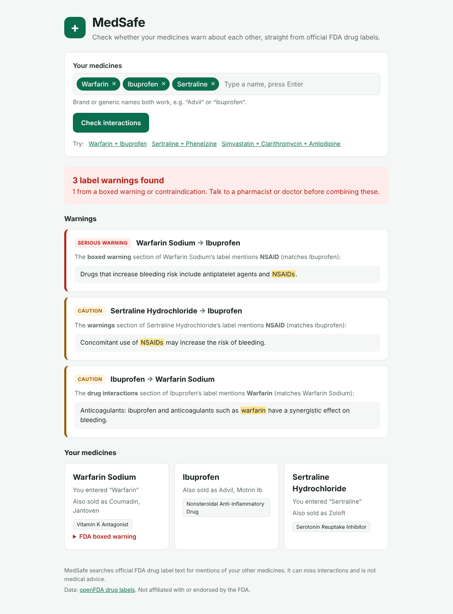
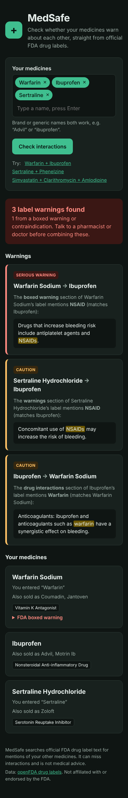

# MedSafe: medication safety checker


People who take several medicines often don't know whether those medicines warn
about each other. **MedSafe** takes a list of medicines (brand or generic names),
fetches each one's **official FDA drug label** from the
[openFDA API](https://open.fda.gov/apis/drug/label/), and shows every place where
one label warns about another medicine. Each warning is ranked by how serious it is
and quotes the exact label text.

<p>
  
  
</p>

> ⚠️ MedSafe is a portfolio project, not a medical device. It can miss
> interactions and is not medical advice.

## Features

- **Brand or generic names**: "Advil" is resolved to ibuprofen.
- **Matching by drug class**: sertraline's label warns about "MAOIs", so MedSafe flags
  it next to phenelzine, a monoamine oxidase inhibitor. Common abbreviations
  (NSAID, SSRI, MAOI, ACE inhibitor, statin…) are mapped to their FDA class names.
- **Salt forms and combination products are handled**: "Warfarin Sodium" is matched
  as "warfarin", and "Acetaminophen and Codeine" is checked ingredient by ingredient.
- **Ranked by severity**: mentions in a *boxed warning* or *contraindications* section
  are serious; mentions under *drug interactions* or *warnings* are cautions.
- **Shows its sources**: every finding quotes the label sentence with the match highlighted.
- **Responsive and accessible**: works on phones, supports dark mode and full keyboard
  use, and announces results to screen readers.

## How it works

```
React (Vite, TypeScript)  ──POST /api/check──▶  FastAPI  ──▶  openFDA drug label API
                                                  │
                                       in-memory TTL cache
```

1. For each medicine, the backend searches openFDA by generic **or** brand name. It
   prefers labels that have a drug-interactions section, and the requests run in parallel.
2. For every ordered pair (A, B), it builds B's search terms (ingredient names without
   salt forms, brand names, drug classes plus their abbreviations) and searches A's label
   sections from most to least serious.
3. It returns the matching sentences, sorted with the most serious first. Results are
   cached for an hour, so repeated checks don't hit openFDA's rate limits.

The interaction logic is in [`backend/app/checker.py`](backend/app/checker.py).

## Tech stack

| Layer | Tools |
| --- | --- |
| Backend | Python 3.12, FastAPI, Pydantic v2, httpx (async) |
| Frontend | React 19, TypeScript, Vite |
| Quality | pytest, Vitest + Testing Library, mypy `--strict`, Ruff, ESLint |
| Delivery | Docker, docker compose, nginx, GitHub Actions CI |

## Run it

**With Docker** (easiest):

```bash
cd MedSafe
docker compose up --build
# open http://localhost:8080
```

**Without Docker** (two terminals):

```bash
# 1. API on http://localhost:8000 (interactive docs at /docs)
cd MedSafe/backend
python3 -m venv .venv && source .venv/bin/activate
pip install -r requirements-dev.txt
uvicorn app.main:app --reload

# 2. Web app on http://localhost:5173
cd MedSafe/frontend
npm install
npm run dev
```

Optional: a free [openFDA API key](https://open.fda.gov/apis/authentication/) raises
the daily request limit. Set `MEDSAFE_OPENFDA_API_KEY` to use it.

## Tests

```bash
cd MedSafe/backend && pytest && mypy app tests && ruff check .
cd MedSafe/frontend && npm test && npm run lint && npm run build
```

Backend tests run against a fake openFDA server, so they need no network. GitHub
Actions runs every check and builds both Docker images on each push.

## API

| Method | Path | Description |
| --- | --- | --- |
| `POST` | `/api/check` | Body `{"drugs": ["warfarin", "Advil"]}` (2–10 names). Returns label summaries, unknown names and interactions. |
| `GET` | `/api/drugs/{name}` | Label summary for one medicine. |
| `GET` | `/api/health` | Health check. |

## Roadmap

- Autocomplete for medicine names
- Save a personal medicine list (accounts + PostgreSQL)
- Plain-language summaries of label warnings
- German interface (EMA / BfArM data sources)
